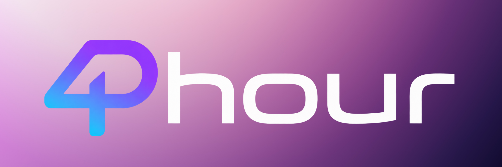

# Phour

A calm, intentional productivity workspace designed to help people focus on what matters most.

  
  
  
  
  
  
  
  

  

  <strong>🌐 App</strong> 
  <a href="https://phour.r4yv.tech" target="_blank" rel="noreferrer">https://phour.r4yv.tech</a>

## About

Phour is a focused productivity workspace for people who want less noise and more momentum. It brings together the essentials of a productive day—tasks, habits, focus time, files, and progress tracking—into one calm, intentional interface.

Instead of juggling fragmented tools, Phour helps you stay centered on what matters most: doing meaningful work with less friction.

## Features

- Authentication with Clerk
- Protected routes and persistent sessions
- Personalized dashboard with greeting, date, and daily insight
- Task management with project organization and prioritization
- Habit tracking for repeatable routines
- Focus timer with custom durations and session persistence
- File upload, preview, rename, and expiration controls
- Productivity insights for a quick snapshot of momentum
- Responsive interface with light and dark themes

## Tech Stack

| Technology | Purpose |
| --- | --- |
| Next.js | Product framework and app experience |
| React | Interactive user interfaces |
| TypeScript | Reliable application development |
| Tailwind CSS | UI styling and responsive design |
| Clerk | Authentication and account security |
| Appwrite | Data and file persistence |
| Vercel | Hosting and deployment |
| pnpm | Package management |

## App

  

Use Phour in production at: https://phour.r4yv.tech

## Roadmap

Planned improvements include:

- AI Assistant
- n8n Integration
- Calendar
- Notifications
- Rich Document Editor
- Analytics
- PWA
- Collaboration

## Contributing

Contributions are welcome. If you want to improve the product, refine the experience, or help shape future features, open an issue or start a discussion.

## License

This project is currently distributed without a formal license file. Before broader reuse or distribution, add a license that matches your intended usage and legal requirements.

---

Made with Next.js, Clerk, Appwrite & Vercel.

**Phour — Intentional productivity.**